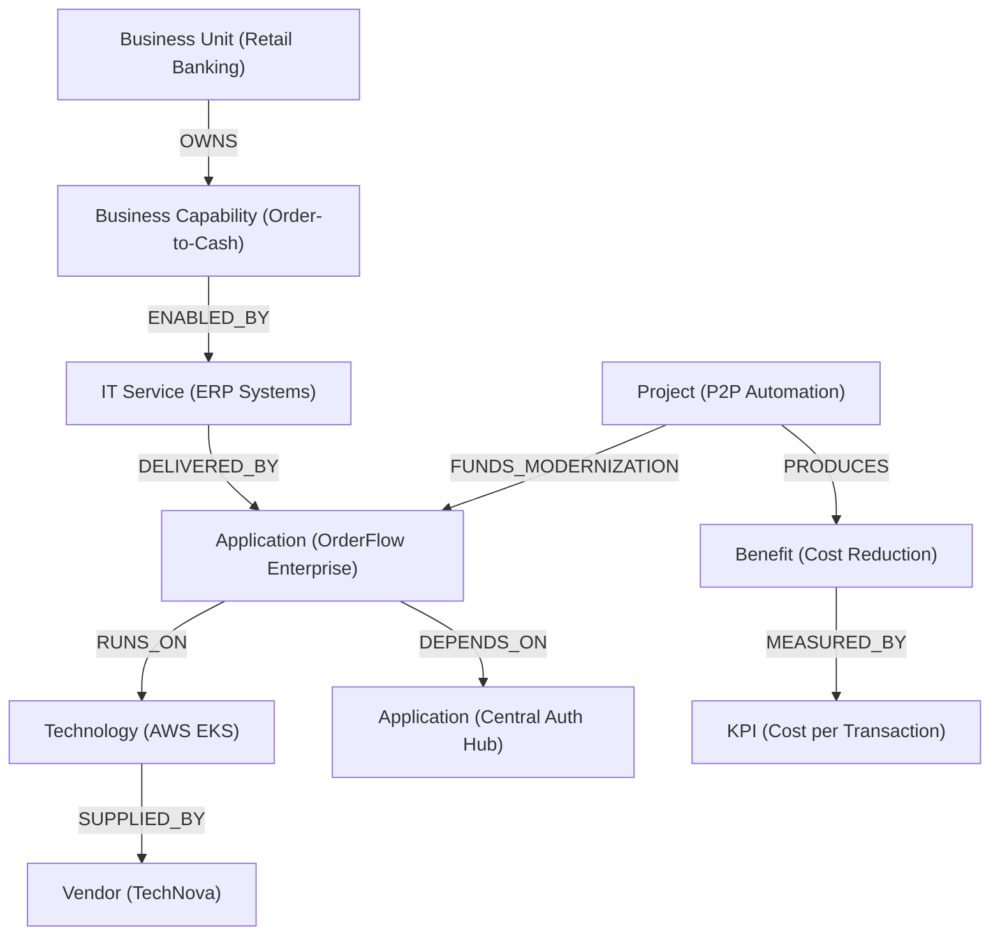

# Technology Value Intelligence (TVI)

**TBM / ITFM / Technology Value Realization Local-First Prototype**

A portfolio-grade, local-first analytical engine and Knowledge Graph architecture built for a 16 GB RAM machine. It demonstrates how a Knowledge Graph transforms Technology Business Management (TBM) and IT Financial Management (ITFM) from static, retroactive cost accounting into proactive, relationship-aware **Technology Value Realization (TVR)**.

---

## 1. Executive Summary

Enterprise technology management today suffers from disconnected data silos:
- **Finance (GL):** Tracks *what was bought* (e.g. servers, software licenses, contractors), but cannot identify *which business capability it enables*.
- **Enterprise Architecture (EA):** Tracks applications, services, and capabilities, but lacks granular monthly cost attribution and unit economics.
- **Infrastructure & FinOps:** Tracks compute hours, storage volumes, and API calls, but cannot quantify the business impact or revenue contribution of those workloads.
- **PMO & Transformation:** Tracks capital investments, but rarely audits whether expected post-delivery benefits actually materialize.

**Technology Value Intelligence (TVI)** bridges these domains:

```text
Technology Cost (Financial GL)
          ↓
     Application
          ↓
      IT Service
          ↓
  Business Capability
          ↓
  Business Consumption
          ↓
 Business / Operational KPI
          ↓
   Technology Value
```

---

## 2. Why Knowledge Graphs for TBM / ITFM?

Relational databases (SQL / DuckDB) excel at columnar aggregations, financial rollups, and time-series variance analysis. However, answering multi-hop enterprise dependency questions using relational tables requires complex, brittle joins across 6–8 tables.

A **Knowledge Graph** models applications, services, capabilities, technologies, vendors, and business units as first-class nodes connected by semantic directed edges:



### Key Questions Answered by the Graph:
1. **What does a business capability actually cost?** (Attributing direct app TCO and proportional shared infrastructure without double-counting).
2. **Which applications have overlapping capabilities?** (Pinpointing duplicate systems supporting the same business capability).
3. **What is the true decommissioning blast radius?** (Tracing direct and transitive upstream and downstream dependencies before retiring an application).
4. **Who consumes technology supplied by Vendor X?** (Multi-hop path traversal from vendor invoices to end-user business units).
5. **Are investment benefits being realized?** (Connecting project capex to post-implementation KPI movements).

---

## 3. Architecture & Separation of Concerns

TVI enforces a strict three-layer architectural separation:

```text
┌─────────────────────────────────────────────────────────────┐
│                       AI & INTERFACE                        │
│   • Dual-Mode Knowledge Graph Analyst (llm.py)              │
│   • Deterministic Rules Mode (Default, Zero Hallucination)  │
│   • Optional Local Ollama LLM Mode                          │
└──────────────────────────────┬──────────────────────────────┘
                               │
                               ▼
┌─────────────────────────────────────────────────────────────┐
│                      ANALYTICS LAYER                        │
│   • Application TCO & Unit Economics (cost_analytics.py)    │
│   • Proportional Capability Attribution (cost_analytics.py) │
│   • Multi-Criteria Rationalization MCDA (rationalization.py)│
│   • Transitive Blast Radius Engine (dependency.py)          │
│   • Benefit Realization & Gap Engine (value_realization.py) │
│   • Cost Driver Variance Decomposition (variance.py)        │
└──────────────┬───────────────────────────────┬──────────────┘
               │                               │
               ▼                               ▼
┌──────────────────────────────┐┌─────────────────────────────┐
│       ANALYTICAL TRUTH       ││  RELATIONSHIP INTELLIGENCE  │
│          (DuckDB)            ││         (NetworkX)          │
│  • High-performance OLAP     ││  • Typed property graph     │
│  • Materialized views        ││  • Multi-hop traversals     │
│  • Exact financial sums      ││  • Focused subgraphs        │
└──────────────────────────────┘└─────────────────────────────┘
```

---

## 4. The 12-Notebook Progressive Curriculum

All 12 notebooks follow an 8-part consulting research framework (Business Problem, Core Concept, Data Model, Implementation, Results, Interpretation, Limitations, Next Steps):

| # | Module / Purpose Directory | Focus & Core Methodology | Workspaces |
| :-: | :--- | :--- | :--- |
| **01** | [`notebooks/01_enterprise_data_generation/`](notebooks/01_enterprise_data_generation) | Deterministic synthetic enterprise generation with 8 embedded business scenarios (A–H), YAML config, AWS CUR cloud billing, 3-tier hierarchy, and data drift. | [v1 Baseline](notebooks/01_enterprise_data_generation/v1_baseline.ipynb) • [v2 Dev](notebooks/01_enterprise_data_generation/v2_development.ipynb) |
| **02** | [`notebooks/02_tbm_itfm_data_model/`](notebooks/02_tbm_itfm_data_model) | Ingesting master data and financial ledgers into an in-process DuckDB columnar warehouse; Parquet export pipelines, zero-copy Arrow queries, streaming ingestion, and migrations. | [v1 Baseline](notebooks/02_tbm_itfm_data_model/v1_baseline.ipynb) • [v2 Dev](notebooks/02_tbm_itfm_data_model/v2_development.ipynb) |
| **03** | [`notebooks/03_knowledge_graph_construction/`](notebooks/03_knowledge_graph_construction) | NetworkX property graph construction; typed node and edge distribution validation; Neo4j Cypher DDL export, spectral graph embeddings, temporal dynamics, and Cytoscape.js. | [v1 Baseline](notebooks/03_knowledge_graph_construction/v1_baseline.ipynb) • [v2 Dev](notebooks/03_knowledge_graph_construction/v2_development.ipynb) |
| **04** | [`notebooks/04_application_cost_intelligence/`](notebooks/04_application_cost_intelligence) | Fully-burdened application TCO, 2-stage Activity-Based Costing (ABC), price escalation sensitivity, FinOps unit economics benchmarks, and TCO forecasts. | [v1 Baseline](notebooks/04_application_cost_intelligence/v1_baseline.ipynb) • [v2 Dev](notebooks/04_application_cost_intelligence/v2_development.ipynb) |
| **05** | [`notebooks/05_capability_cost_intelligence/`](notebooks/05_capability_cost_intelligence) | Capability-based costing, dynamic allocation rules, nested 3-tier taxonomy (L1-L3), cloud migration what-if simulator, and mathematical reconciliation audits. | [v1 Baseline](notebooks/05_capability_cost_intelligence/v1_baseline.ipynb) • [v2 Dev](notebooks/05_capability_cost_intelligence/v2_development.ipynb) |
| **06** | [`notebooks/06_consumption_intelligence/`](notebooks/06_consumption_intelligence) | Multidimensional telemetry profiling, 2x2 quadrants, STL time-series decomposition, serverless auto-scaling metrics, GreenOps CO2e, and automated rightsizing. | [v1 Baseline](notebooks/06_consumption_intelligence/v1_baseline.ipynb) • [v2 Dev](notebooks/06_consumption_intelligence/v2_development.ipynb) |
| **07** | [`notebooks/07_application_rationalization/`](notebooks/07_application_rationalization) | Multi-Criteria Decision Analysis (MCDA); Rationalization Review Index (RRI); MCDA sensitivity analysis, migration complexity vs savings Pareto frontier, phased decommissioning roadmaps, and contractual exit penalty modeling. | [v1 Baseline](notebooks/07_application_rationalization/v1_baseline.ipynb) • [v2 Dev](notebooks/07_application_rationalization/v2_development.ipynb) |
| **08** | [`notebooks/08_dependency_impact_analysis/`](notebooks/08_dependency_impact_analysis) | Direct vs transitive reverse graph traversal; Single Point of Failure (SPOF) bottleneck identification; Monte Carlo cascading outage simulations, automated CI/CD release deployment gating, and Zero-Trust network containment audits. | [v1 Baseline](notebooks/08_dependency_impact_analysis/v1_baseline.ipynb) • [v2 Dev](notebooks/08_dependency_impact_analysis/v2_development.ipynb) |
| **09** | [`notebooks/09_investment_benefit_realization/`](notebooks/09_investment_benefit_realization) | Capital investment budget variance; expected vs realized benefit gap analysis; discounted cash flow valuation (NPV, IRR, Payback), econometric Difference-in-Differences (DiD), and capability maturity progression. | [v1 Baseline](notebooks/09_investment_benefit_realization/v1_baseline.ipynb) • [v2 Dev](notebooks/09_investment_benefit_realization/v2_development.ipynb) |
| **10** | [`notebooks/10_cost_driver_variance_analysis/`](notebooks/10_cost_driver_variance_analysis) | Month-over-Month (MoM) spend shift decomposition; rolling Z-score & IsolationForest cost anomaly detection, contractual SLA breach penalty calculations, forward budget variance forecasting with 90% confidence bands, and automated FinOps ticket generation. | [v1 Baseline](notebooks/10_cost_driver_variance_analysis/v1_baseline.ipynb) • [v2 Dev](notebooks/10_cost_driver_variance_analysis/v2_development.ipynb) |
| **11** | [`notebooks/11_local_llm_knowledge_graph_analyst/`](notebooks/11_local_llm_knowledge_graph_analyst) | Guarded natural language interface; conversational session memory with anaphora pronoun resolution; expanded analytical intents (blast radius gating, SLA penalties, decommissioning roadmap, capability maturity); zero arbitrary code execution; and automated executive briefing slide generation. | [v1 Baseline](notebooks/11_local_llm_knowledge_graph_analyst/v1_baseline.ipynb) • [v2 Dev](notebooks/11_local_llm_knowledge_graph_analyst/v2_development.ipynb) |
| **12** | [`notebooks/12_end_to_end_value_intelligence/`](notebooks/12_end_to_end_value_intelligence) | Complete end-to-end value chain traversal; synthesis of the formal 9-section Board-level Executive Report for the CIO & CFO; self-contained executive HTML briefing export, structured 5-slide JSON presentation deck, Slack/Teams webhook payloads, external industry quartile benchmarks, and strategic portfolio rebalancing simulation. | [v1 Baseline](notebooks/12_end_to_end_value_intelligence/v1_baseline.ipynb) • [v2 Dev](notebooks/12_end_to_end_value_intelligence/v2_development.ipynb) |

---

## 5. Embedded Scenarios Matrix

The dataset deterministically embeds 8 real-world enterprise phenomena:

- **Scenario A (Scale Anchor - `APP001`):** CoreBanking Alpha incurs high annual TCO (> ₹15 Cr), but serves 8,500+ monthly active users and 6.5M transactions, producing an ultra-low unit cost of ₹0.023/txn.
- **Scenario B (Underutilized Legacy - `APP021`):** Legacy Customer Web Portal costs ₹8.4 Cr/year, but serves < 150 active users (cost/user > ₹58,000), qualifying as a prime rationalization candidate.
- **Scenario C (Capability Duplication - `CAP003`):** Order-to-Cash is supported concurrently by `APP005` (Strategic OrderFlow) and `APP012` (QuickOrder Legacy), creating immediate consolidation opportunities.
- **Scenario D (Single Point of Failure - `APP010`):** Central Auth Hub has 8 mission-critical systems directly dependent on it, representing a high-risk topological bottleneck.
- **Scenario E (High-Performing Investment - `PRJ003`):** Real-Time Payment Modernization finished under budget (₹11.5 Cr actual vs ₹12.0 Cr budget) and achieved 108% benefit realization (₹20.7 Cr realized).
- **Scenario F (Transformation Benefit Gap - `PRJ014`):** Global Legacy CRM Consolidation incurred budget overruns (₹29.0 Cr actual vs ₹25.0 Cr budget) and only achieved 23.3% benefit realization (Benefit Gap: ₹23.0 Cr).
- **Scenario G (Elastic Scale - `APP014`):** Spend jumped +171% in August, correlated with a **+180% surge in transactions**, proving healthy operational elasticity.
- **Scenario H (Unbacked Cost Anomaly - `APP022`):** Spend jumped +₹38L/month in August while transactions and user counts were flat, triggering an immediate FinOps rate investigation.

---

## 6. Installation & Quickstart

### Prerequisites
- Python 3.11, 3.12, or 3.13
- [uv](https://docs.astral.sh/uv/) (recommended) or standard `python -m venv`

### Step 1: Create Virtual Environment with Python 3.13
```bash
uv venv .venv --python python3.13
source .venv/bin/activate
```

### Step 2: Install Dependencies & Package
```bash
uv pip install -r requirements.txt -e .
```

### Step 3: Register Jupyter Kernel
```bash
python -m ipykernel install --sys-prefix --name technology-value-intelligence
```

---

## 7. Running Verification & Tests

### Automated Validation Suite
Execute the four-tier verification check:
```bash
python -m tvi.validation
```
**Expected Output:**
```text
Data validation: PASS
Database validation: PASS
Graph validation: PASS
Analytics validation: PASS
```

### Unit Test Suite
Execute the full pytest suite:
```bash
pytest tests/ -v
```
All 75 unit tests validate data generation, database aggregations, graph queries, TCO unit economics, rationalization scoring, TVR benefit metrics, and v2 capabilities across Phases 1, 2, 3, and 4 (YAML scenario parameterization, AWS CUR cloud billing, Parquet exports, Arrow queries, Cypher exports, spectral embeddings, Activity-Based Costing, FinOps benchmarks, TCO forecasting, dynamic capability rules, nested hierarchies, cloud what-if simulation, reconciliation audits, STL decomposition, serverless metrics, GreenOps, rightsizing, MCDA sensitivity, Pareto frontiers, decommissioning roadmaps, exit penalties, Monte Carlo cascade simulations, CI/CD release gates, Zero-Trust audits, Mermaid flowcharts, discounted cash flow NPV/IRR, econometric DiD causal inference, stage-gate health scorecards, capability maturity progression, rolling Z-score & IsolationForest anomaly detection, SLA breach penalties, forward variance forecasting with confidence bands, automated FinOps ticketing, conversational memory with anaphora resolution, extended analytical intents, slide generation, executive HTML export, JSON slide deck, Slack/Teams webhooks, industry peer benchmarking, and portfolio rebalancing simulation).

### Executing All Notebooks
To rerun and re-record outputs for all 24 notebooks (12 baseline + 12 development) in-process:
```bash
python scripts/execute_all_notebooks.py
```

---

## 8. Optional Local LLM Integration (Ollama)

By default, TVI operates in **deterministic rules mode** (`MODE = "rules"`), which requires zero external services or internet connectivity.

If you have [Ollama](https://ollama.com/) running locally:
1. Start Ollama:
   ```bash
   ollama run llama3
   ```
2. Enable in `config.yaml`:
   ```yaml
   llm:
     enabled: true
     provider: "ollama"
     model: "llama3"
     base_url: "http://localhost:11434"
   ```
If Ollama is not active, the system automatically and safely falls back to deterministic rule-based explanations.

---

## 9. Hardware & Memory Footprint

- **Target System:** Tested on standard 16 GB RAM machines.
- **Storage:** Embedded DuckDB database file is < 10 MB.
- **RAM Usage:** In-memory NetworkX graph and analytical DataFrames consume < 250 MB total RAM.
- **Zero Cloud Footprint:** Runs 100% locally with zero cloud dependencies or paid APIs.

---

## 10. Analytical Guardrails & Limitations

1. **Analytical Scenarios vs Guaranteed Savings:** We explicitly state that an application's current spend represents an *avoidable cost scenario* rather than a guaranteed cash saving (accounting for contractual termination penalties and retained fixed infrastructure).
2. **Association vs Causality:** Project outcomes are documented as *associated with* KPI movements, preventing false claims of direct single-factor causation.
3. **Synthetic Enterprise Model:** All corporate entities, vendors, and application names are synthetic and designed for educational and analytical benchmarking.

---

## 11. Production Roadmap (Future Evolution)

- **Phase 2:** Connect enterprise Lakehouses (Databricks, Snowflake) via read-only connectors.
- **Phase 3:** Migrate graph backend from NetworkX to **Neo4j** for real-time traversal across millions of CMDB configuration items.
- **Phase 4:** Ingest vendor contract PDFs and architecture RFCs using local RAG embeddings.
- **Phase 5:** Autonomous multi-agent FinOps workflows for real-time anomaly remediation.
